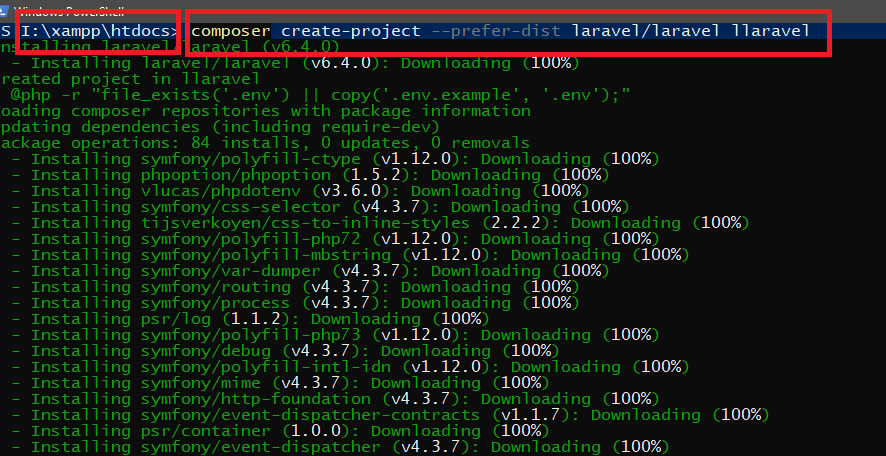

# LARAVEL-6-Developing-A-to-Z
All instructions for learning LARAVEL 5.7 for the beginner

## Installation Requirements:
- Composer (Must Installed)
- Xampp
- php v.7.2.0

## Installation Steps:

1. Goto your Xampp `htdocs` folder or open command promote in this folder.
2. type `composer create-project --prefer-dist laravel/laravel PROJECT_NAME_HERE` than press Enter.
3. After pressing enter laravel downloading process will be start in cmd.

4. Open your browser type "localhost/PROJECT_NAME_HERE" and hit Enater.
5. Now show your Laravel Welcome Page in your browser.

## Configuration Routes:

